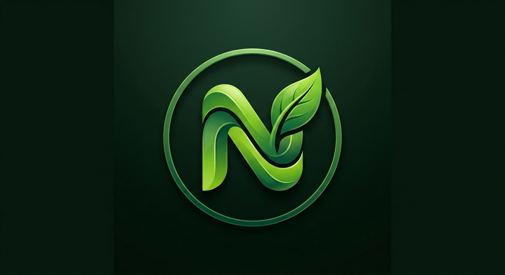

#  Nutrica — Be Your Own Nutritionist

[](https://github.com/your-username/Nutrica/actions/workflows/android.yml)
[](https://developer.android.com)
[](https://kotlinlang.org)
[](https://developer.android.com/jetpack/compose)
[](LICENSE)

**Nutrica** is a premium, beautifully crafted Android companion designed to make nutrition tracking, dietary planning, and personalized meal insights accessible, immediate, and smart. Embodying our guiding philosophy, **"Fueling a Better Tomorrow,"** Nutrica acts as your offline-capable, AI-driven personal nutritionist.

---

## ✨ Features

- **🧠 Nutrica AI Coach:** Interactive, conversational advice, tailored workout recommendations, diet planning, and personalized recipe construction.
- **📸 Intelligent Barcode Scanner:** Scan or select packaging barcodes to instantly fetch detailed nutritional profiles, analyze ingredients, and flags potential allergens.
- **📊 Real-time Progress Tracking:** Keep logs of calories consumed, macronutrients (proteins, carbs, fats), and hydration milestones.
- **🔥 Streak & Engagement Gamification:** Earn achievements, check in daily, level up, and unlock sports milestones like the *Nutrica Pro Athlete* badge.
- **🥗 Custom Recipes Generator:** Construct dynamic dietary modifications and custom ingredient-saving recommendations on demand.
- **🗄️ Offline-First Architecture:** Integrated Local SQLite Room Database for fast, secure, and zero-latency profile persistence.

---

## 🎨 Visual Identity & UI Style

Nutrica utilizes a modern, luxurious, high-contrast dark theme engineered for visual comfort and high readability:

- **Theme Palette:** Anchored by a deep dark background (**NightDark**), contrasted against a vibrant primary green (**EmeraldGreen**) to signify organic vitality and health.
- **Modern Typography:** Elevated with clean letter-spacing, elegant weights, and dynamic size scaling.
- **Component Padding:** Built entirely upon Material Design 3 guidelines with generous spacing, negative margins, and responsive layouts to avoid clutter.
- **Custom Brand Mark:** A sleek, minimalist 3D **'N'** enclosed inside an organic gold-green leaf circle, blending geometry with nature.

---

## 🛠️ Technology Stack

Nutrica is written using industry-standard modern Android technologies:

- **Kotlin:** 100% Kotlin codebase using modern coroutines and state management.
- **Jetpack Compose:** Completely declarative UI built on Material Design 3 components.
- **Architecture:** **MVVM (Model-View-ViewModel)** with Repository pattern for clean separation of concerns.
- **Room Database:** Complete local cache for seamless offline tracking and data persistence.
- **Retrofit & Moshi:** Type-safe, asynchronous HTTP networking client for fetching nutrition models and barcodes.
- **Firebase AI (Gemini SDK):** Direct, low-latency client-side AI integration to power coaching, smart recipe edits, and barcode explanations.
- **Secrets Gradle Plugin:** Keeps API Keys and credentials safe using `.env` injections.

---

## 📂 Repository Structure

The project has a highly modular, clean Android organization:

```text
Nutrica/
├── .github/
│   ├── workflows/
│   │   └── android.yml            # Automatic Github Actions CI configuration
│   └── ISSUE_TEMPLATE/            # Templates for Logging bugs & suggestions
│       ├── bug_report.md
│       └── feature_request.md
├── app/
│   ├── src/
│   │   ├── main/
│   │   │   ├── java/com/example/  # Core Source Files
│   │   │   │   ├── data/          # Room Entities, DAOs, and Local Database
│   │   │   │   ├── ui/            # Screens, Components, Theme, and Navigation
│   │   │   │   └── viewmodel/     # ViewModel storing state and business logic
│   │   │   └── res/               # Vector Drawables, Strings, and Custom Icons
│   │   └── test/                  # Unit and Robolectric Tests
│   └── build.gradle.kts           # Module-level Gradle configurations
├── gradle/
│   └── libs.versions.toml         # Centralized Dependency Version Catalog
├── .env.example                   # Secure Keys Template file
├── CONTRIBUTING.md                # Development, Code Style, and PR Guidelines
├── LICENSE                        # Open-source MIT License
└── settings.gradle.kts            # Project settings
```

---

## 🚀 Setting Up the Project

### 1. Get the Source Code
```bash
git clone https://github.com/your-username/Nutrica.git
cd Nutrica
```

### 2. Configure Your API Secrets
Nutrica injects API credentials securely using **Secrets Gradle Plugin**. 

- Create a `.env` file at the root:
  ```bash
  cp .env.example .env
  ```
- Open `.env` and fill in your Gemini API credential:
  ```properties
  GEMINI_API_KEY=your_gemini_api_key_here
  ```

### 3. Build & Run
Open the directory in **Android Studio (Koala+)** and click **Run**. Or compile via CLI:

```bash
# Compile and build debug APK
gradle assembleDebug

# Run unit tests
gradle :app:testDebugUnitTest
```

---

## 🤝 Contributing

We welcome contributions of all types! Please read our [CONTRIBUTING.md](CONTRIBUTING.md) to understand branch conventions, code review criteria, and test assertions.

Ensure that the automatic linting and test workflows are fully respected:
```bash
gradle :app:testDebugUnitTest
gradle :app:verifyRoborazziDebug
```

---

## 📄 License

This project is licensed under the MIT License — see the [LICENSE](LICENSE) file for complete details.
