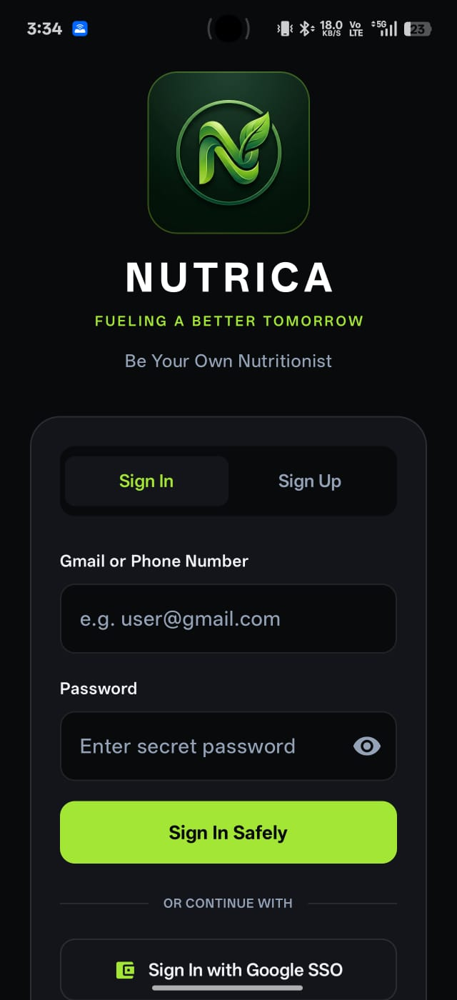
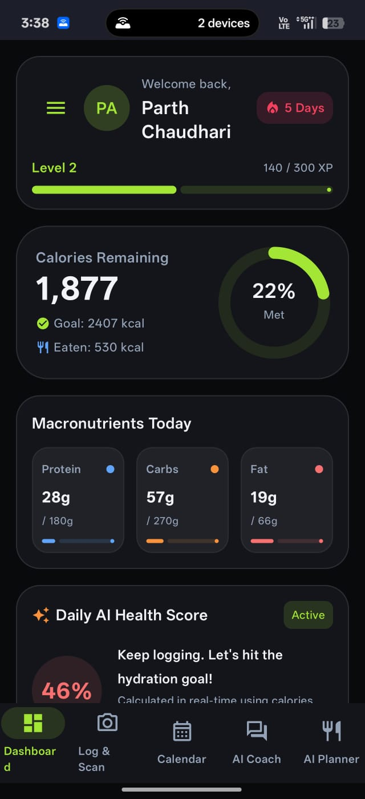
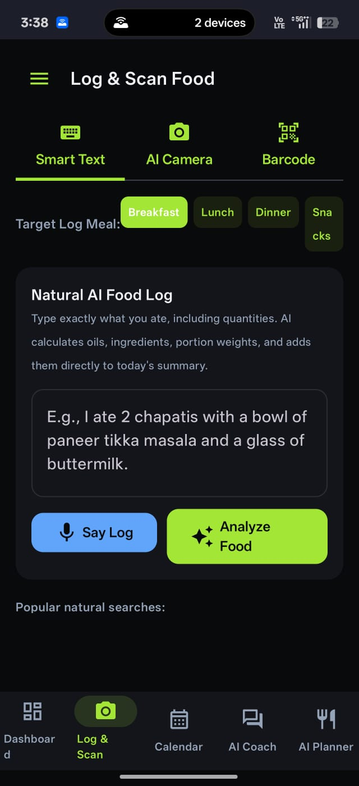
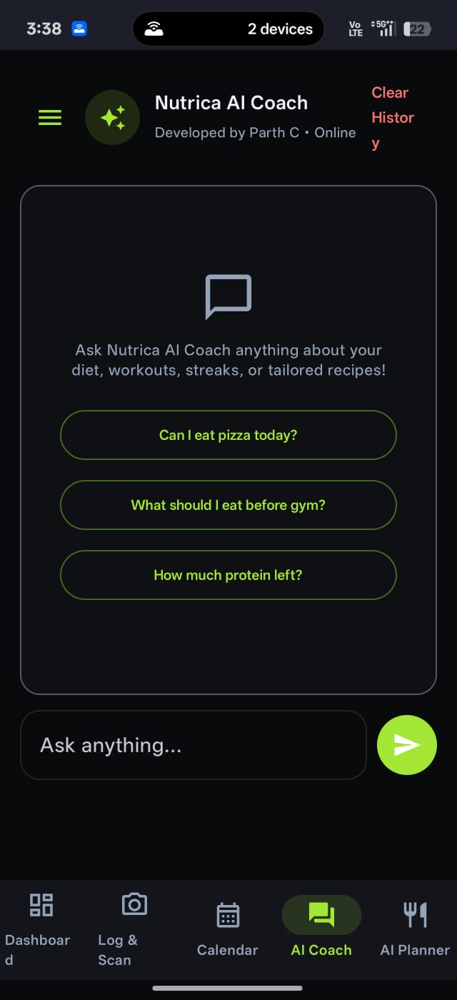
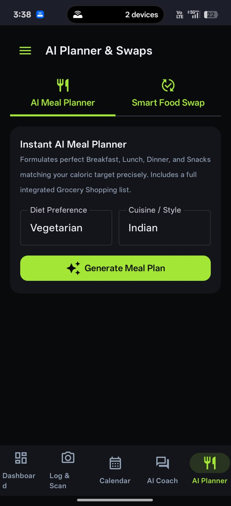

# Nutrica - Be Your Own Nutrionist

[](https://github.com/ChaudhariParthh/Nutrica/actions/workflows/android.yml)
[](https://developer.android.com)
[](https://kotlinlang.org)
[](https://developer.android.com/jetpack/compose)
[](LICENSE)

Nutrica is a no-code AI-powered nutrition assistant built using Google AI Studio with the Gemini 3.5 Flash model and advanced prompt engineering. It features a Nutrition Dashboard, Calendar-Based Meal Tracking, AI-powered Coaching, and Smart Nutrition Logging.

App Demo : https://drive.google.com/file/d/13ayqd5Uo9EpZEHM8TjkbBfhMtHnFgTc0/view?usp=sharing
---

## Screenshots

Below are example app screens. Each image has a short title above it and the images are ordered: Login, Dashboard, Scan, AI Coach, and Food Planner.

### Login
<p></p>

### Dashboard
<p></p>

### Scan
<p></p>

### AI Coach
<p></p>

### Food Planner
<p></p>

---

Nutrica is a comprehensive Android nutrition tracking platform that empowers users to become their own nutritionists. Built with modern Android technologies and powered by AI-driven insights, Nutrica combines barcode scanning, real-time nutrition logging, and personalized AI coaching to deliver a seamless nutrition management experience.

**Core Philosophy:** "Fueling a Better Tomorrow" - Making nutrition science accessible, actionable, and personalized.

---

## Features

**AI-Powered Coaching**
- Interactive conversational nutrition guidance
- Tailored workout recommendations and diet planning
- Personalized recipe generation and dietary modifications

**Intelligent Barcode Integration**
- Scan or manually select product barcodes
- Instant access to detailed nutritional profiles
- Ingredient analysis and allergen flagging

**Comprehensive Tracking**
- Real-time calorie and macronutrient logging
- Protein, carbohydrates, and fat tracking
- Hydration milestone monitoring
- Daily check-ins and progress visualization

**Engagement and Gamification**
- Achievement system and daily streaks
- Milestone unlocking (Pro Athlete badges)
- Motivational engagement features

**Recipe Management**
- Custom recipe generation engine
- Dynamic dietary modifications
- Ingredient-based recommendations
- Saved recipe organization

**Offline-First Architecture**
- Local SQLite Room database integration
- Zero-latency profile persistence
- Seamless offline data synchronization

---

## Visual Design System

Nutrica implements a modern, accessible design language:

**Color Palette**
- Primary Background: Deep Night Dark for visual comfort
- Primary Accent: Emerald Green symbolizing organic health and vitality
- High contrast ratios ensure accessibility and readability

**Typography & Layout**
- Material Design 3 component guidelines
- Generous spacing and negative margins
- Responsive layouts optimized for mobile screens
- Custom brand identity: Minimalist 3D 'N' within gold-green leaf circle

---

## Technology Stack

**Core Technologies**
- **Language:** 100% Kotlin with modern coroutines and flow-based state management
- **UI Framework:** Jetpack Compose with Material Design 3 components
- **Architecture:** MVVM (Model-View-ViewModel) with Repository pattern
- **Local Storage:** SQLite via Room persistence library
- **Networking:** Retrofit with Moshi serialization for type-safe HTTP operations
- **AI Integration:** Firebase Gemini SDK for client-side AI coaching
- **Security:** Secrets Gradle Plugin for environment-based credential management

---

## Project Structure

```
Nutrica/
├── .github/
│   ├── workflows/
│   │   └── android.yml                    # GitHub Actions CI/CD configuration
│   └── ISSUE_TEMPLATE/
│       ├── bug_report.md                  # Bug report template
│       └── feature_request.md             # Feature request template
├── app/
│   ├── src/
│   │   ├── main/
│   │   │   ├── java/com/example/
│   │   │   │   ├── data/
│   │   │   │   │   ├── local/            # Room entities and DAOs
│   │   │   │   │   ├── remote/           # API service interfaces
│   │   │   │   │   └── repository/       # Data access abstraction layer
│   │   │   │   ├── ui/
│   │   │   │   │   ├── screens/          # Feature screens (Home, Profile, etc.)
│   │   │   │   │   ├── components/       # Reusable UI components
│   │   │   │   │   ├── theme/            # Material Design theming
│   │   │   │   │   └── navigation/       # Navigation graph and routing
│   │   │   │   ├── viewmodel/            # MVVM state holders
│   │   │   │   ├── util/                 # Utility functions and extensions
│   │   │   │   └── di/                   # Dependency injection (Hilt)
│   │   │   ├── res/
│   │   │   │   ├── drawable/             # Vector drawables and icons
│   │   │   │   ├── values/               # String resources and constants
│   │   │   │   └── layout/               # Legacy layout files (if applicable)
│   │   │   └── AndroidManifest.xml
│   │   ├── test/
│   │   │   ├── unit/                     # Unit tests with JUnit and Mockk
│   │   │   └── robolectric/              # Android framework tests
│   │   └── androidTest/
│   │       └── instrumented/             # Instrumentation tests for device/emulator
│   └── build.gradle.kts                  # Module-level Gradle configuration
├── gradle/
│   └── libs.versions.toml                # Centralized dependency version catalog
├── .env.example                          # Template for secure credentials
├── build.gradle.kts                      # Root Gradle build configuration
├── settings.gradle.kts                   # Project configuration
├── CONTRIBUTING.md                       # Development and contribution guidelines
├── LICENSE                               # MIT License
└── README.md                             # This file
```

---

## Development Guide

### Creating an App in Android Studio

#### Step 1: Project Setup
1. Launch Android Studio (Koala or later)
2. Click **File > New > New Project**
3. Select **Android App** template
4. Configure project details:
   - Name: `Nutrica`
   - Package name: `com.example.nutrica`
   - Minimum SDK: API 26+
   - Language: Kotlin
   - Build system: Gradle (Kotlin DSL)

#### Step 2: Define Initial Concept
1. In the project creation wizard, use the **AI App Studio** section
2. Input your app concept as a detailed prompt:
   ```
   Create a nutrition tracking Android app with AI coaching, 
   barcode scanning, real-time calorie tracking, and offline-first 
   local storage using Room database. Include gamification elements 
   and personalized meal planning features.
   ```
3. If your prompt needs optimization, use any LLM service to refine it before submission

#### Step 3: Configure GitHub Integration
1. Navigate to project settings in Android Studio
2. In the **Settings > Version Control > Git** section:
   - Authorize GitHub access
   - Select or create your repository
3. Android Studio will automatically generate initial project files

#### Step 4: Integrate with GitHub Repository
1. Create a new repository on GitHub (e.g., `ChaudhariParthh/Nutrica`)
2. In Android Studio, go to **VCS > Git > Remotes** and configure origin
3. Commit initial files: **VCS > Git > Commit Directory** with message:
   ```
   Initial commit: Project scaffold with Compose and Room dependencies
   ```
4. Push to GitHub: **VCS > Git > Push**

#### Step 5: Customize Features and Codebase
1. Update `build.gradle.kts` with required dependencies (Retrofit, Moshi, Firebase Gemini, etc.)
2. Create data models in `data/local/` and `data/remote/`
3. Build UI screens in `ui/screens/`
4. Implement ViewModels in `viewmodel/`
5. Configure navigation in `ui/navigation/`

---

## Local Development Setup

### Prerequisites
- Android Studio Koala or later
- Android SDK 26+ (target SDK 34+)
- Kotlin plugin enabled in Android Studio
- Git installed and configured

### Installation Steps

#### 1. Clone the Repository
```bash
git clone https://github.com/ChaudhariParthh/Nutrica.git
cd Nutrica
```

#### 2. Configure API Credentials
Nutrica uses environment-based secrets for API key management.

1. Create a `.env` file at the project root:
   ```bash
   cp .env.example .env
   ```

2. Open `.env` and add your Gemini API key:
   ```properties
   GEMINI_API_KEY=your_gemini_api_key_here
   BARCODE_API_KEY=your_barcode_api_key_here
   ```

3. The Secrets Gradle Plugin automatically injects these into `BuildConfig` at compile time

#### 3. Open in Android Studio
```bash
cd Nutrica
# On macOS
open -a "Android Studio" .

# On Linux or Windows, launch Android Studio and open the directory
```

#### 4. Build and Run
**Via Android Studio:**
1. Connect an emulator or physical device
2. Click **Run** (green play button) or press Shift+F10
3. Select the target device

**Via Command Line:**
```bash
# Build debug APK
./gradlew assembleDebug

# Install on connected device
./gradlew installDebug

# Run with logs
./gradlew installDebug logcat
```

---

## Testing Your App on Mobile Devices

### Enable Developer Mode on Physical Device

**For Android 6.0+:**
1. Open **Settings > About Phone**
2. Locate **Build Number** field
3. Tap **Build Number** exactly 7 times (rapid succession)
4. A toast message confirms: "Developer mode enabled"

### Enable USB Debugging
1. Return to main **Settings**
2. Navigate to **System > Developer Options** (now visible)
3. Enable **USB Debugging** toggle
4. A system dialog requests permission - tap **Allow**

### Install App on Device

**Via Android Studio:**
1. Connect device via USB cable
2. Accept the USB debugging prompt on your device
3. In Android Studio top-right, select your device from the device dropdown
4. Click **Run** (green play button)
5. Android Studio builds, signs, and installs the APK automatically
6. The app launches on your device

**Via Command Line:**
```bash
# Verify device is connected
./gradlew devices

# Build and install
./gradlew installDebug

# Grant runtime permissions if needed
adb shell pm grant com.example.nutrica android.permission.CAMERA
```

### What to Expect
- First installation takes 30-60 seconds
- Subsequent installations are faster with incremental builds
- App opens automatically after installation
- All data is stored locally on the device

---

## Publishing Considerations

### Current Limitations
- Direct Play Store publication is not yet available in this preview build
- The app requires additional compliance and security certifications

### Future Publishing Path
1. Complete security audit and OWASP compliance check
2. Implement in-app purchase infrastructure (if monetization planned)
3. Set up App Signing by Google Play for release builds
4. Submit to Play Store with required marketing assets
5. Undergo 2-4 week review process

### Distribution Alternatives (Current)
- Internal team testing via APK distribution
- Beta testing through Android Studio's Beta Channel feature
- Enterprise deployment via MDM (Mobile Device Management) solutions

---

## Building and Testing

### Compile Project
```bash
# Build debug variant
./gradlew assembleDebug

# Build release variant (requires signing configuration)
./gradlew assembleRelease

# Build and run unit tests
./gradlew :app:testDebugUnitTest

# Run instrumented tests on device/emulator
./gradlew :app:connectedAndroidTest

# Run Robolectric tests for fast Android testing
./gradlew :app:testDebugRobolectric
```

### Linting and Code Quality
```bash
# Run Kotlin linter
./gradlew lintDebug

# Format code according to project style
./gradlew spotlessApply

# Verify code style compliance
./gradlew spotlessCheck
```

---

## Contributing

We welcome contributions from the community. To contribute:

1. **Read [CONTRIBUTING.md](CONTRIBUTING.md)** for:
   - Branch naming conventions (feature/*, bugfix/*, etc.)
   - Code style and formatting standards
   - Pull request guidelines and review criteria
   - Test coverage expectations

2. **Development Workflow:**
```bash
# Create feature branch
git checkout -b feature/your-feature-name
   
# Make changes and test
./gradlew testDebugUnitTest
   
# Commit with descriptive message
git commit -m "feat: Add barcode scanning feature"
   
# Push and create Pull Request
git push origin feature/your-feature-name
```

3. **Code Review Checklist:**
- All tests pass locally
- Code follows Kotlin style guide
- No hardcoded API keys or secrets
- Documentation updated for new features
- UI changes tested on multiple screen sizes

4. **Automated Quality Checks:**
```bash
# Run complete test suite before submitting PR
./gradlew testDebugUnitTest
./gradlew connectedAndroidTest
./gradlew lintDebug
./gradlew spotlessCheck
```

---

## Documentation

- **Architecture Overview:** See [ARCHITECTURE.md](docs/ARCHITECTURE.md) for design patterns and system design
- **API Documentation:** See [API.md](docs/API.md) for networking and data models
- **Setup Guide:** See [SETUP.md](docs/SETUP.md) for environment configuration
- **Troubleshooting:** See [TROUBLESHOOTING.md](docs/TROUBLESHOOTING.md) for common issues

---

## License

Nutrica is licensed under the MIT License. See [LICENSE](LICENSE) for full details.

---

## Support and Feedback

- **Report Bugs:** Use [GitHub Issues](https://github.com/ChaudhariParthh/Nutrica/issues) with the bug report template
- **Request Features:** Use [GitHub Discussions](https://github.com/ChaudhariParthh/Nutrica/discussions) or the feature request template
- **Security Issues:** Email security concerns directly rather than using public issues

---

## Acknowledgments

Built with:
- Android Jetpack libraries
- Material Design 3
- Firebase AI services
- Open-source community contributions
